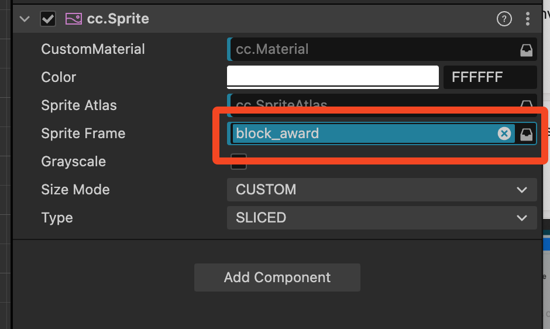
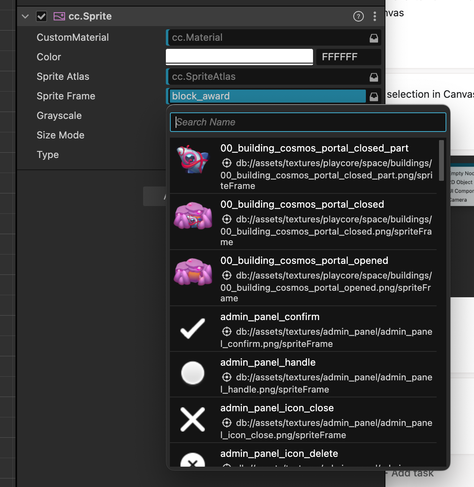

# Asset Picker

`<AssetPicker>` is a component that allows you to pick an asset. It will be used in the inspector to pick an asset for an object.

It consists of 2 parts:

1. A input that opens a select menu to choose an asset.
2. A select menu that displays the available assets.

## Input

Input part consists of

- input with the name of the selected asset on the left
- clear button to clear/remove the selected asset on the right (trash or X icon)
- select button to open the select menu on the right (drawer icon)

It should look like this, notice the part that outlined in red:

### Error State

When the asset is not found, the input should be red and the tooltip should show the error message.

Also, the corresponding item in Hiearchy Panel should have a warning icon. It is not a part of the asset picker featuer, but should be implemented in the future.

## Select Menu

The select menu opens when you click on the select button in the input part.

The menu consists of 2 parts - the search input on the top and the scollable list of assets on the bottom.

The list of assets consists of rows. Each row has a asset preview on the left and the name of the asset on the right.

It should look like this:

## Props

- `assetsIds`: `string[]` - the list of assets ids to display in the picker
- `onSelect`: `(assetId: string) => void` - the function to call when an asset is selected
- `onClear`: `() => void` - the function to call when the clear button is clicked

## Common Use Cases

- pick a web font asset for a text
- pick an image or spritesheet frame for an image
