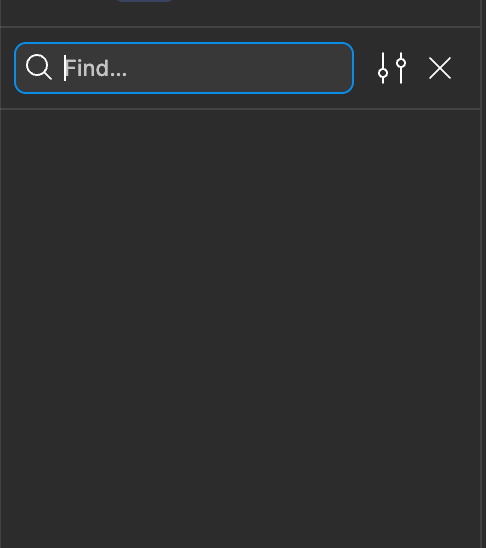
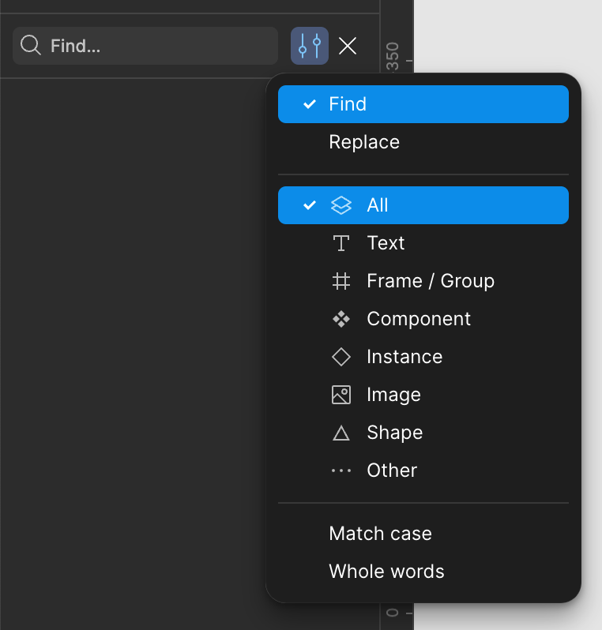

# Assets Search

`<AssetsSearch>` is a component that allows you to search for assets. It will be a part of Assets Panel.

It has 2 states:

1. Collapsed - when the search input is hidden and only the button to expand the search is visible
2. Expanded - when the search input is visible and the search results are displayed

## Collapsed State

In collapsed state, the only search button is visible. The button is located at the top right corner of the Assets Panel, near to `<PanelTitle>`.

The button has a magnifying glass icon and a hover state with a tooltip "Search assets".

When user clicks the button the whole Assets Panel goes into "Search" mode.

## Expanded State or Search Mode

In expanded state, the search input is visible, it replaces the panel title and takes almost all the width of the Assets Panel.

To the right of the search input, there are 2 buttons: settings button and close button.

When user clicks the settings button, a dropdown menu with the search settings should appear. Look at Search Settings section for more details.

When user clicks the close button, the Assets Panel goes back to the collapsed state.

Below the search input, instead of assets tree we display the search results as a flat list of assets.

The search should use a fuzzy search algorithm, the `fzf` library is already installed and should be used.

## Search Settings Dropdown

Search settings are a dropdown menu that appears when user clicks the settings button.

As of now, it will have only 1 section - Asset Type. User can select the asset types to search for. By default, the "All" option is selected.

The available asset types are listed in the `AssetTreeItemDataType` union type in `src/types/assets.ts`.

Search settings should be implemented in the `<AssetsSearchSettings>` component. It should not be a modal, but a dropdown menu that appears when user clicks the settings button.

