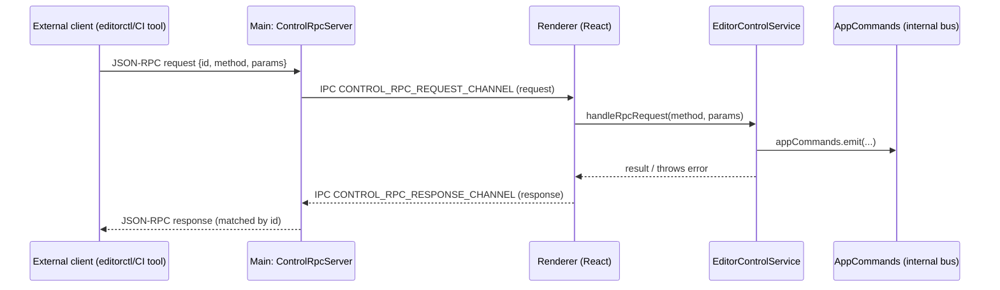
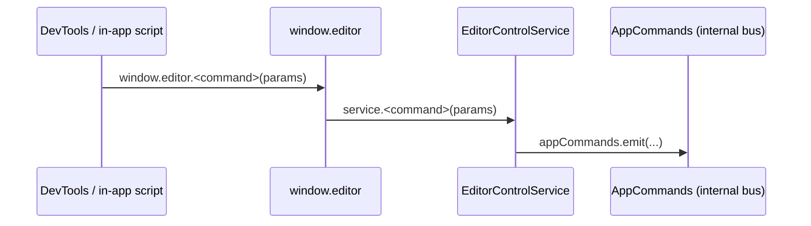

## Editor control (architecture)

This feature provides **external control of the running editor** by translating high-level commands (open project, open prefab, list assets, selection, etc.) into internal editor actions.

There are **two entry points**:

- **`editorctl` (CLI)**: Path: `packages/editorctl/`. Uses runtime discovery (`getControlMeta`) and JSON-only stdin/stdout.
- **WebSocket JSON-RPC (main process)**: external tools connect to Electron via `ws://127.0.0.1:<port>`, send JSON-RPC requests, and receive JSON-RPC responses.
- **Window API (renderer)**: dev-only `window.editor.*` methods that call the same internal service directly (no IPC/WS).

This document focuses on **how the parts interact** and where to add/extend commands safely.

## Parts

### External client (any language/tool)

Speaks **JSON-RPC 2.0** over WebSocket:

- Request: `{ jsonrpc: "2.0", id, method, params? }`
- Response: `{ jsonrpc: "2.0", id, result }` or `{ jsonrpc: "2.0", id|null, error }`

### `editorctl` (CLI)

Path: `packages/editorctl/`

- Usage doc: [`editorctl.md`](./editorctl.md)
- Exposes meta-only commands (`call`, `methods`, `schema`, `help`) and relies on `getControlMeta` for discovery.
- Sends JSON-RPC over WebSocket using `@tekton/editorctl-client`.
- **Type source**: `@tekton/control-rpc-contract`.
- Includes meta commands (`call`, `methods`, `schema`, `help`, `target`) that rely on `getControlMeta` for discovery.

### Control RPC Enablement

Control RPC is **always enabled** in all builds, except when running in **E2E mode** (Playwright).

When enabled:

- The main process starts a WebSocket server.
- The renderer process installs a bridge to handle incoming requests.
- The editor status is periodically updated to the main process for discovery.

### Main process WebSocket router: `ControlRpcServer`

Path: `src/main/ControlRpcServer.ts`

Responsibilities:

- Accepts WebSocket connections.
- Parses and validates incoming JSON-RPC requests.
- Forwards requests to the renderer via Electron IPC (`webContents.send` on `CONTROL_RPC_REQUEST_CHANNEL`).
- Routes renderer responses back to the original WebSocket by tracking pending requests keyed by JSON-RPC `id`.

Important behavior:

- Always targets **the first BrowserWindow** (`BrowserWindow.getAllWindows()[0]`).
- Validation uses the **control contract** (`@tekton/control-rpc-contract`) for both method allowlisting and parameter parsing.

### Preload IPC bridge: `window.controlIpc`

Path: `src/preload/create-control-ipc.ts` + `src/preload/preload.ts`

Responsibilities:

- Exposes a small IPC facade into the renderer:
    - `onRpcRequest(handler)` → subscribe to `CONTROL_RPC_REQUEST_CHANNEL`
    - `sendRpcResponse(response)` → send to `CONTROL_RPC_RESPONSE_CHANNEL`

Enablement:

- `window.controlIpc` is exposed in all builds, but the renderer only uses it when the **Control RPC** setting is enabled.

### Renderer bridge: `useControlRpcBridge`

Path: `src/renderer/control-rpc/renderer-rpc.ts`

Responsibilities:

- Enabled unless running in **E2E mode** (Playwright).
- When enabled, listens for `window.controlIpc` requests.
- Dispatches them to `EditorControlService.handlers` using a generic method lookup.
- Sends JSON-RPC responses back to main via `window.controlIpc.sendRpcResponse`.

Error handling:

- Invalid request shape: error `400` (`invalid json-rpc request`)
- Unknown method: error `404`
- Unhandled exception: error `500` with the thrown message (or `internal error`)

### Renderer API: `window.editor`

Path: `src/renderer/control-rpc/expose-window-editor.ts` (wired in `src/renderer/App.tsx`)

Responsibilities:

- **Dev-only** (`import.meta.env.DEV`): exposes `window.editor.*` methods that call `EditorControlService.handlers` directly (no WS/IPC).
- This is useful for debugging commands from the DevTools console.
- In production, `window.editor` is not exposed.

### Command translation layer: `EditorControlService`

Path: `src/renderer/control-rpc/service/EditorControlService.ts`

This is the **“thin waist”**:

- Provides a `handlers` map that is required to satisfy the full `ControlApi` contract.
- Each handler validates parameters / resolves ids (e.g. “id or path must be provided”).
- Handlers translate external requests into **internal command bus events** via `appCommands.emit(...)`.
- In a few cases, handlers call internal application functions directly (e.g. `openProjectByPath`).

## How the parts interact

### WebSocket JSON-RPC flow (external → main → renderer → editor)



### Window API flow (renderer-only)



## Commands, naming, and types

### External naming convention

- **External methods are camelCase** (e.g. `openProject`, `switchToContext`).
- Internally, `EditorControlService` typically emits the same string (but kebab-case) on the app command bus.

### Where “truth” lives (single authority)

There is now a **single control contract**:

- `packages/control-rpc-contract/src/ControlApi.ts`
    - Defines Zod schemas for inputs/outputs (runtime validation).
    - Provides derived `ControlMethod` / `ControlInput` / `ControlOutput` types.

All callers (main WS router, renderer bridge, `EditorControlService`, and `editorctl`) derive types from this contract.

**Note:** `listHierarchy` returns a **tree** (`HierarchyNode` with `children?`). `editorctl` prints the raw tree as JSON (there is no human-readable table output anymore).

**Note:** `listAssetsTree` returns the **asset tree** (`AssetNode[]`). It supports optional filtering by type or subtree path:

- Request: `{"method":"listAssetsTree","params":{"types":["prefab","folder"]}}`
- Response: `{ assets: [...] }` (a pruned tree: nodes are kept if they match the filter or contain matching descendants)

**Note:** `listAssetsOfType` returns a **flat array** of all matching nodes:

- Request: `{"method":"listAssetsOfType","params":{"type":"prefab"}}`
- Response: `[...]` (a flat array of matching `AssetNode` objects)

Example (`editorctl`):

```bash
npm run editorctl -- --port <wsPort> call listAssetsTree '{"types":["prefab"]}'
npm run editorctl -- --port <wsPort> call listAssetsOfType '{"type":"prefab"}'
```

Paths returned by `listAssetsTree` and `listAssetsOfType` are **project-relative** (relative to `projectDir`). For spritesheet frames/folders, `path` is a **virtual hierarchy path** used for display.

## Screenshot commands (debug group)

- `takeAppScreenshot`: Full app window (web contents) screenshot.
- `takeCanvasScreenshot`: Phaser canvas screenshot (optionally hides editor overlays).
- `takeAppPartScreenshot`: DOM element screenshot selected by CSS selector (first match, viewport-clipped).

Example (`editorctl`):

```bash
npm run editorctl -- --port <wsPort> call takeAppPartScreenshot '{"selector":"[data-testid=\\"hierarchy-panel\\"]","format":"png"}'
```

## Camera commands (misc group)

- `setCamera`: update camera zoom and/or scroll position.
- `focusOnObject`: focus the camera on a scene object by id (optional zoom or padding override).

Examples (`editorctl`):

```bash
npm run editorctl -- --port <wsPort> call setCamera '{"zoom":1.5,"scrollX":100,"scrollY":50}'
npm run editorctl -- --port <wsPort> call focusOnObject '{"id":"<objectId>","zoom":2}'
```

If `zoom` is omitted, `focusOnObject` uses a fit-to-bounds zoom with 10% padding (default).

## Modal commands (misc group)

These commands control **global** renderer modals. Only one modal can be open at a time; opening a modal closes any previously open modal.

- `openModal`: open a modal by id (optional params per modal)
- `closeModal`: close a specific modal by id
- `closeAllModals`: close any open modal
- `listModals`: list all modals and their open/closed status

Examples (`editorctl`):

```bash
npm run editorctl -- --port <wsPort> call openModal '{"id":"settings","params":{"sectionId":"general"}}'
npm run editorctl -- --port <wsPort> call listModals '{}'
npm run editorctl -- --port <wsPort> call closeAllModals '{}'
```

## How to add new command

This checklist covers the end-to-end path: **external JSON-RPC → main WS router → renderer bridge → `EditorControlService` → internal editor action → `editorctl`**.

### 1) Choose the external method name (camelCase)

Pick a **camelCase** method string, e.g. `duplicateObject`.

### 2) Add the method to `packages/control-rpc-contract/src/ControlApi.ts`

File: `packages/control-rpc-contract/src/ControlApi.ts`

- Add a new entry with `input` and `output` Zod schemas.
- Keep names **camelCase**.

Why: both main and renderer validate incoming requests using this contract, and all types are derived from it.

### 3) Implement the behavior in a handler module

Files:

- Add a new handler module in `src/renderer/control-rpc/service/handlers/` (flat files).
- Export a factory function (e.g. `export const yourMethod: CommandHandler<'yourMethod'> = (ctx) => ...`) that returns the async handler.
- **Naming requirement**: The handler function name MUST match the command name defined in `ControlApi.ts`. If you rename a command, you MUST rename its handler too.

Use **guard clauses** (return early / throw early) for validation.
Translate the request into internal actions:

- Prefer `ctx.appCommands.emit('<internal-command>', payload)` when the app already has a command.
- Otherwise call a well-scoped internal function directly (as `openProjectByPath` does).

### 4) Add your handler to the service assembly

File: `src/renderer/control-rpc/service/EditorControlService.ts`

- Import your handler module and spread it into the handler map.
- The `satisfies ControlApi` check ensures new contract methods cannot be missed.

### 5) Expose it on `window.editor` (optional but recommended for dev)

File: `src/renderer/control-rpc/expose-window-editor.ts`

- Add `window.editor.<yourMethodCamelCase> = (params) => handlers.<yourMethodCamelCase>(params)`

Also update typings:

- File: `types/globals.d.ts` → extend the `window.editor` interface with your method.

### 6) Keep `editorctl` types in sync (control contract)

No extra work needed beyond the control contract:

- `@tekton/editorctl-client` imports types from `@tekton/control-rpc-contract`.
- `editorctl` will pick up new types automatically.

### 7) `editorctl` CLI (no changes required)

`editorctl` uses `getControlMeta` at runtime. When you add a new RPC method, it shows up in discovery without manual CLI registrations.

### 8) Sanity-check method validation and routing assumptions

- Main always targets `BrowserWindow.getAllWindows()[0]`.
    - If you ever support multiple windows, you’ll need routing logic (window selection) in `ControlRpcServer`.
- Make sure your request `params` are JSON-serializable.
- Make sure your response shape matches the control contract output schema.
