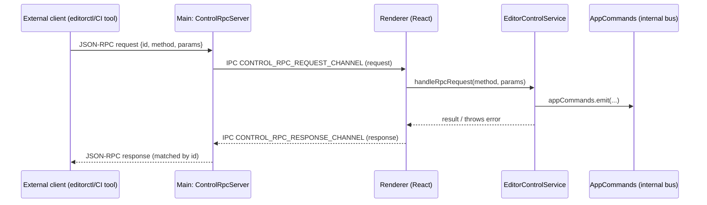
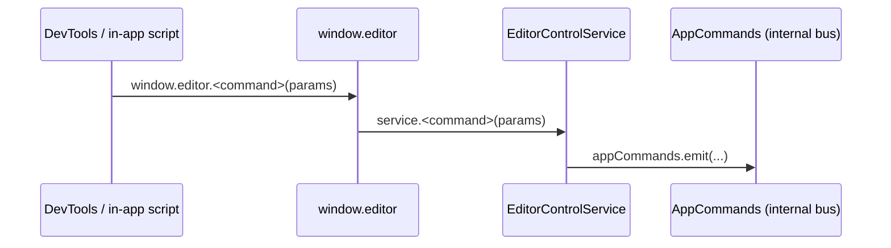

## Editor control (architecture)

This feature provides **external control of the running editor** by translating high-level commands (open project, open prefab, selection, etc.) into internal editor actions.

There are **two entry points**:

- **WebSocket JSON-RPC (main process)**: external tools connect to Electron via `ws://127.0.0.1:<port>`, send JSON-RPC requests, and receive JSON-RPC responses.
- **Window API (renderer)**: dev-only `window.editor.*` methods that call the same internal service directly (no IPC/WS).

This document focuses on **how the parts interact** and where to add/extend commands safely.

## Parts

### External client (any language/tool)

Speaks **JSON-RPC 2.0** over WebSocket:

- Request: `{ jsonrpc: "2.0", id, method, params? }`
- Response: `{ jsonrpc: "2.0", id, result }` or `{ jsonrpc: "2.0", id|null, error }`

### `editorctl` (CLI)

Path: `scripts/editorctl/`

- Uses `commander` to define CLI commands (e.g. `open-project`, `hierarchy`, `select-object`).
- Sends JSON-RPC over WebSocket using `WsTransport` (`scripts/editorctl/lib/transport/ws.ts`) and `RpcClient` (`scripts/editorctl/lib/rpc/client.ts`).
- **Type source**: `scripts/editorctl/lib/rpc/types.ts` imports types from `src/backend-contract/types.ts`, which are derived from `src/backend-contract/contract.ts`.

### Main process WebSocket router: `ControlRpcServer`

Path: `src/backend-main/control-rpc/main-rpc.ts`

Responsibilities:

- Accepts WebSocket connections.
- Parses and validates incoming JSON-RPC requests.
- Forwards requests to the renderer via Electron IPC (`webContents.send` on `CONTROL_RPC_REQUEST_CHANNEL`).
- Routes renderer responses back to the original WebSocket by tracking pending requests keyed by JSON-RPC `id`.

Important behavior:

- Always targets **the first BrowserWindow** (`BrowserWindow.getAllWindows()[0]`).
- Validation uses `isJsonRpcRequest` from `src/control-rpc/rpc.ts`, which means the **allowed `method` set is enforced in main**.

### Preload IPC bridge: `window.controlIpc`

Path: `src/backend-preload/control-rpc/preload.ts` + `src/backend-preload/index.ts`

Responsibilities:

- Exposes a small IPC facade into the renderer:
  - `onRpcRequest(handler)` → subscribe to `CONTROL_RPC_REQUEST_CHANNEL`
  - `sendRpcResponse(response)` → send to `CONTROL_RPC_RESPONSE_CHANNEL`

Enablement (current behavior):

- `window.controlIpc` is exposed only when `process.env.NODE_ENV !== 'production'`.

### Renderer bridge: `useControlRpcBridge`

Path: `src/control-rpc/renderer-rpc.ts`

Responsibilities:

- In dev (`import.meta.env.DEV`), listens for `window.controlIpc` requests.
- Dispatches them to `EditorControlService`.
- Sends JSON-RPC responses back to main via `window.controlIpc.sendRpcResponse`.

Error handling (current behavior):

- Invalid request shape: error `400` (`invalid json-rpc request`)
- Unknown method: error `404`
- Unhandled exception: error `500` with the thrown message (or `internal error`)

### Renderer API: `window.editor`

Path: `src/control-rpc/expose-window-editor.ts` (wired in `src/App.tsx`)

Responsibilities:

- In dev (`import.meta.env.DEV`), exposes `window.editor.*` methods that call `EditorControlService` directly (no WS/IPC).

### Command translation layer: `EditorControlService`

Path: `src/control-rpc/EditorControlService.ts`

This is the **“thin waist”**:

- Validates parameters / resolves ids (e.g. “id or path must be provided”).
- Translates external requests into **internal command bus events** via `appCommands.emit(...)`.
- In a few cases, calls internal application functions directly (e.g. `openProjectByPath`).

## How the parts interact

### WebSocket JSON-RPC flow (external → main → renderer → editor)

### Window API flow (renderer-only)

## Commands, naming, and types

### External naming convention

- **External methods are kebab-case** (e.g. `open-project`, `switch-to-context`).
- Internally, `EditorControlService` typically emits the same string on the app command bus.

### Where “truth” currently lives (keep this in sync)

There are two separate places describing the same command surface:

- `src/control-rpc/rpc.ts`
  - Defines `RPC_METHODS` (what main + renderer consider a valid JSON-RPC `method`).
  - Defines JSON-RPC request/response types used by the WS bridge (`JsonRpcRequest`, `JsonRpcResponse`).
  - Defines renderer-side parameter types used by `EditorControlService` and `window.editor` typings.
- `src/backend-contract/contract.ts`
  - Defines Zod schemas for methods (and therefore the `BackendMethod`/input/output types).
  - `editorctl` compiles against these types via `src/backend-contract/types.ts`.

If these drift, you can get situations where:

- The WS server rejects a method name (main validates against `RPC_METHODS`),
- or `editorctl` compiles while the renderer expects a different payload shape,
- or the CLI expects one response shape while the renderer returns another.

**Known mismatch (current):**

- `src/control-rpc/EditorControlService.listHierarchy()` returns a **tree** (`HierarchyNode` with `children?`).
- `src/backend-contract/contract.ts` declares `list-hierarchy` output as a **flat array** with optional `parentId`.
- `scripts/editorctl/commands/hierarchy.ts` expects the **flat array** shape.

## How to add new command

This checklist covers the end-to-end path: **external JSON-RPC → main WS router → renderer bridge → `EditorControlService` → internal editor action → `editorctl`**.

### 1) Choose the external method name (kebab-case)

Pick a **kebab-case** method string, e.g. `duplicate-object`.

### 2) Add the method to `src/control-rpc/rpc.ts`

File: `src/control-rpc/rpc.ts`

- Add the method to `RPC_METHODS`.
- Add/extend parameter and result types as needed (keep them minimal and RPC-facing).

Why: both main and renderer validate incoming requests using `isJsonRpcRequest`, which uses `RPC_METHODS`.

### 3) Implement the behavior in `EditorControlService`

File: `src/control-rpc/EditorControlService.ts`

- Add a method like `duplicateObject(params: ...)`.
- Use **guard clauses** (return early / throw early) for validation.
- Translate the request into internal actions:
  - Prefer `this.appCommands.emit('<internal-command>', payload)` when the app already has a command.
  - Otherwise call a well-scoped internal function directly (as `openProjectByPath` does).

### 4) Wire the WS bridge handler in `src/control-rpc/renderer-rpc.ts`

File: `src/control-rpc/renderer-rpc.ts`

- Add a `case '<your-method>'` to `handleRpcRequest`.
- Call your new `EditorControlService` method.
- Return:
  - `createJsonRpcResult(id, null)` for “fire and forget” commands, or
  - `createJsonRpcResult(id, <data>)` for query-style commands.

### 5) Expose it on `window.editor` (optional but recommended for dev)

File: `src/control-rpc/expose-window-editor.ts`

- Add `window.editor.<yourMethodCamelCase> = (params) => service.<yourMethodCamelCase>(params)`

Also update typings:

- File: `types/globals.d.ts` → extend the `window.editor` interface with your method.

### 6) Keep `editorctl` types in sync (backend contract)

Files:

- `src/backend-contract/contract.ts`:
  - Add a new entry for your method with Zod `input`/`output` schemas.
  - Keep names **kebab-case**.
- `src/backend-contract/types.ts`:
  - No direct edit typically needed (types are derived automatically).

Why: `editorctl` uses these types for compile-time safety (`BackendMethod`, `BackendInput`, `BackendOutput`).

### 7) Add the CLI command in `scripts/editorctl/`

Files:

- Add a command file in `scripts/editorctl/commands/` (pattern: `open-project.ts`, `select-object.ts`, etc.)
  - Parse flags/options with `commander`.
  - Call `ctx.rpc.request('<your-method>', params)`.
  - Print via `ctx.output`.
- Register it in `scripts/editorctl/commands/index.ts` in `registerAllCommands`.

### 8) Sanity-check method validation and routing assumptions

- Main always targets `BrowserWindow.getAllWindows()[0]`.
  - If you ever support multiple windows, you’ll need routing logic (window selection) in `ControlRpcServer`.
- Make sure your request `params` are JSON-serializable.
- Make sure your response shape matches both:
  - `src/control-rpc/*` (what renderer actually returns), and
  - `src/backend-contract/contract.ts` (what `editorctl` thinks it returns).
