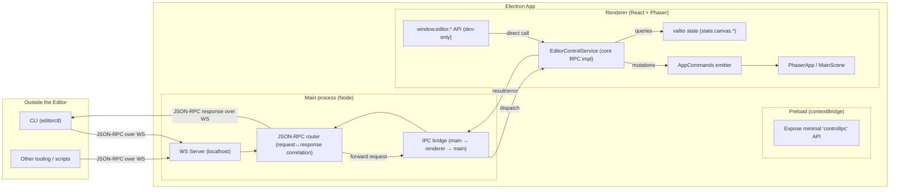

# External control (CLI) via RPC — Implementation Plan (Electron)

## Goals

Enable controlling the editor “from outside” (dev-only) with **request/response** semantics:

- Open prefab (by **asset id** or **file path**)
- List current scene hierarchy (as a stable tooling-friendly tree)
- Select object (by **id** or **path**)
- Switch edit context (by **id** or **path**)
- Delete objects (by ids)

Additionally, support two access paths:

- **Window API** for quick debugging and Playwright-style automation (`window.editor.*`) — **dev-only**
- **WebSocket JSON-RPC server in Electron main** for real external processes (Node/CLI)

Non-goals for v1:

- No event streaming (selection changed / hierarchy changed, etc.)
- Skip generic `set-property` for now
- No auth (dev-only; localhost-only)

## Electron-specific approach (what changed vs browser-only)

Old plan assumed the editor runs in a browser and can “connect out” to a local controller over WS.

Now the editor runs as a **desktop Electron app** with:

- **Main process**: Node environment, can host servers, owns OS integration
- **Renderer**: Vite/React app, **no Node** (`contextIsolation: true`, `nodeIntegration: false`)
- **Preload**: safe IPC bridge via `contextBridge`

So the transport entrypoint moves to **Electron main** (WS server), and editor operations remain implemented in the **renderer** (where `AppCommands` + valtio state live). Main routes JSON-RPC requests to the renderer and returns responses back to the CLI.

## High-level approach

Introduce a small RPC layer that:

1. Uses **JSON-RPC 2.0** messages for transport (`id`-correlated request/response).
2. Implements editor operations in the renderer by:
   - Executing existing mutations via `AppCommands` (write side)
   - Reading data via a small “read API” on top of `state.canvas` (read side)
3. Exposes the same core methods through:
   - `window.editor.*` (direct in-renderer calls, dev-only)
   - Electron main **WebSocket server** (CLI/tools connect in) + **IPC bridge** (main ↔ renderer)

## Orchestration diagram (Electron)



## RPC method set (v1)

All method names are **kebab-case**.

### Write methods (execute via existing `AppCommands`)

- `open-prefab`
  - params: `{ "assetId"?: string, "path"?: string }`
  - behavior:
    - If `assetId` provided → `appCommands.emit('open-prefab', assetId)`
    - If `path` provided → resolve to prefab asset id, then emit `open-prefab`

- `select-object`
  - params: `{ "id"?: string, "path"?: string }`
  - behavior:
    - If `id` → `appCommands.emit('select-object', id)`
    - If `path` → resolve to id, then emit

- `switch-to-context`
  - params: `{ "id"?: string, "path"?: string }`
  - behavior:
    - If `id` → `appCommands.emit('switch-to-context', id)`
    - If `path` → resolve to id, then emit

- `delete-objects`
  - params: `{ "ids": string[] }`
  - behavior: `appCommands.emit('delete-objects', ids)`

### Read methods (query via `state.canvas`)

- `list-hierarchy`
  - params: `{ "contextId"?: string }` (optional for future use; v1 can ignore and return full tree)
  - returns: a stable simplified tree:

```ts
type HierarchyNode = {
  id: string
  name: string
  type: string
  children?: HierarchyNode[]
}
```

Source of truth: `state.canvas.root` (an `EditableContainerJson | null`).

## Message format (JSON-RPC 2.0)

### Request

```json
{
  "jsonrpc": "2.0",
  "id": "c0c2b6d0-...",
  "method": "list-hierarchy",
  "params": { }
}
```

### Response (success)

```json
{
  "jsonrpc": "2.0",
  "id": "c0c2b6d0-...",
  "result": { }
}
```

### Response (error)

```json
{
  "jsonrpc": "2.0",
  "id": "c0c2b6d0-...",
  "error": { "code": 400, "message": "object not found", "data": { } }
}
```

Notes:

- Allow **multiple concurrent in-flight** requests (map by `id`).
- Fail fast: if renderer is not ready or IPC fails → return JSON-RPC error.

## Window API (dev-only)

Expose named functions (not a single generic `call`) for easy scripting:

```ts
declare global {
  interface Window {
    editor?: {
      openPrefab(params: { assetId?: string; path?: string }): Promise<void>
      listHierarchy(): Promise<HierarchyNode>
      selectObject(params: { id?: string; path?: string }): Promise<void>
      switchToContext(params: { id?: string; path?: string }): Promise<void>
      deleteObjects(params: { ids: string[] }): Promise<void>
    }
  }
}
```

Implementation detail:

- `window.editor.*` calls the same internal `EditorControlService` methods used by WS.
- Keep it **dev-only** (guarded by `import.meta.env.DEV`).

## WebSocket server (Electron main) — dev-only

### Connection direction

- External tooling connects **to Electron**:
  - `ws://127.0.0.1:<port>`

### Configuration (dev-only)

Use a hardcoded default with overrides:

- Default: `ws://127.0.0.1:17870`
- Override via env (main process): `EDITOR_CONTROL_WS_PORT=12345`

Precedence:

1. env
2. default

### Lifecycle

- Start WS server on app startup **only when not packaged** (`!app.isPackaged`).
- Stop WS server on app quit.
- Log connection state and effective address/port (main process logs).

## IPC bridge (main ↔ renderer)

Main process cannot `invoke` renderer directly, so we use an explicit request/response bridge:

- Main receives JSON-RPC request over WS
- Main forwards it to the renderer window (target window selected by **window id**) with a correlation id
- Renderer executes `EditorControlService` and sends response back
- Main returns JSON-RPC response over WS

Suggested channels (names are illustrative):

- `control:rpc-request` (main → renderer)
- `control:rpc-response` (renderer → main)

Correlation:

- Use the JSON-RPC `id` as the correlation key end-to-end.

Security model (dev-only):

- WS binds to `127.0.0.1` only.
- No auth required in v1.

## Core editor control service (renderer)

Implement `EditorControlService` in the renderer:

- Has access to `AppCommandsEmitter` (for mutations)
- Has access to `state` (for reads)
- Implements the v1 methods with guard clauses:
  - no current prefab loaded
  - root is null
  - object not found (by id or by path resolution)

Path resolution:

- Object path format: `"root/menu/playButton"` (same as existing `get-object-path` output).
- Implement a pure resolver: walk `state.canvas.root` and map path → id.

Prefab path resolution:

- Resolve prefab file path → prefab asset id by scanning `state.assets.items` for a prefab asset with matching `.path`.

## CLI (`editorctl`)

Suggested command UX:

- `editorctl open-prefab --asset-id <id>`
- `editorctl open-prefab --path <abs-or-project-path>`
- `editorctl hierarchy` (prints JSON to stdout)
- `editorctl select --id <id>`
- `editorctl select --path <path>`
- `editorctl switch-context --id <id>`
- `editorctl switch-context --path <path>`
- `editorctl delete --ids <id1,id2,...>`

Internals:

- CLI connects to the local WS server (`ws://127.0.0.1:17870` by default)
- Sends one JSON-RPC request per command
- Exits non-zero on error

## Implementation steps (incremental)

### Phase 0 — Foundations

- Add a small shared type module for:
  - JSON-RPC request/response types
  - RPC method names (kebab-case string literal union)
  - `HierarchyNode` output type

### Phase 1 — Core editor control service (renderer)

- Implement `EditorControlService` (renderer):
  - Executes write methods via existing `AppCommands`
  - Implements read methods via `state.canvas`
  - Uses guard clauses with useful error messages

### Phase 2 — Window API (renderer, dev-only)

- Attach `window.editor` in dev only.
- Implement the named methods by calling `EditorControlService`.
- Ensure errors are thrown/rejected with useful messages (so Playwright/automation can assert).

### Phase 3 — IPC bridge (preload + main + renderer)

- Implement renderer-side listener for `control:rpc-request`:
  - validate JSON-RPC request → call `EditorControlService` → send JSON-RPC response
- Implement main-side router that:
  - forwards incoming WS requests to the target renderer window (by **window id**)
  - correlates responses back to WS connections

Note: with `contextIsolation: true`, the renderer should not import `electron` directly. Any required IPC wiring should go through preload `contextBridge` (a minimal “controlIpc” API).

### Phase 4 — WS server in Electron main (dev-only)

- Start WS server in main when `!app.isPackaged`
- On WS message:
  - validate JSON-RPC request
  - forward to renderer via IPC bridge
  - return JSON-RPC response
- Handle invalid messages with JSON-RPC error responses.

### Phase 5 — CLI

- Implement `editorctl`:
  - connect → send request → await response → print result → exit

## Acceptance checklist (v1)

- From **window API** (DevTools console / Playwright) in **dev**, you can:
  - Open a prefab by asset id
  - List hierarchy as stable tree
  - Select object by id and by path
  - Switch context by id and by path
  - Delete by ids

- From **CLI via WS server hosted by Electron main** in **dev**, you can do the same, with:
  - Proper request/response correlation
  - Meaningful errors when renderer is not ready / editor window not available
  - Meaningful errors when no editor window is connected/selected by window id

